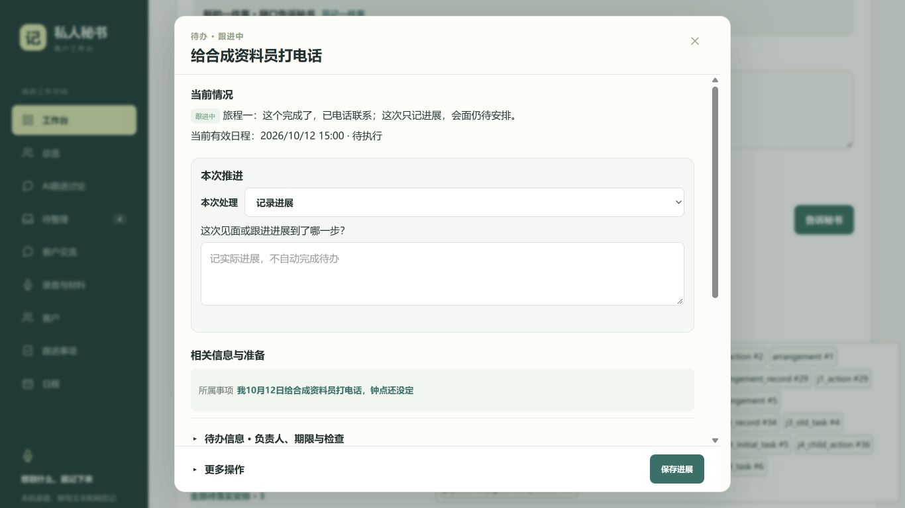
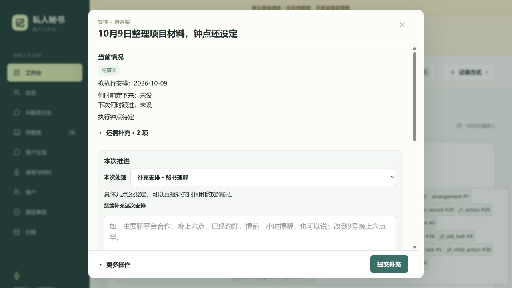
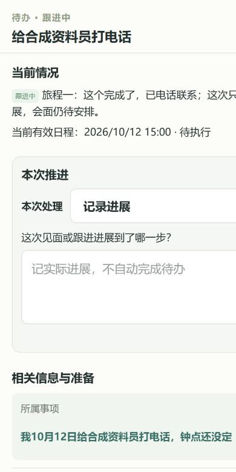
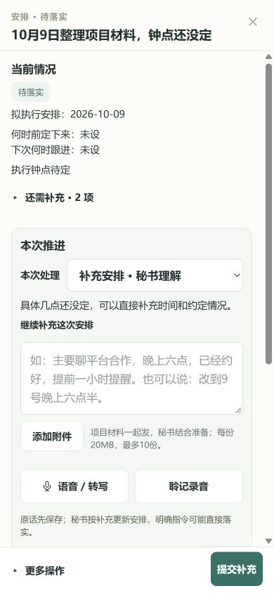

# 详情合成数据参考

这些是2026-10-06改版后的合成QA截图，所有对象均为演练资料。它们只展示新版结果，不冒充历史界面或真实手机软键盘验收。

原始客户/沟通截图保留在开发者本机，已精确排除出公开Git。设计依据的阅读顺序、状态和业务契约完整保留在根目录规格中。

[验收汇总](ACCEPTANCE.md) · [详情规格](../../DETAIL_DIALOG_SPEC.md)

图片实际像素：待办桌面1366×768、安排桌面1280×720、待办手机390×780、安排手机390×844。截图像素与浏览器CSS视口测量分开记录，不能从截图推断真实软键盘状态。
